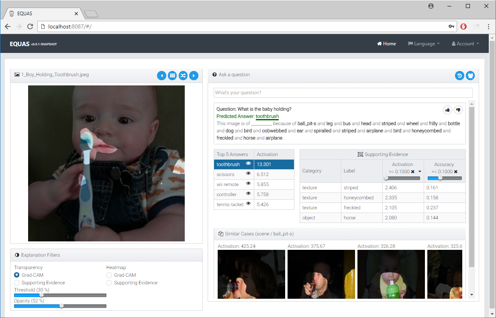

# EQUAS

This readme describes the requirements and steps for running the EQUAS infrastructure via Docker.

## Prerequisites
    
  #### System Requirements
  - Ubuntu 16.04+
  - Nvidia CUDA capable GPU with latest Drivers
    ```      
    sudo add-apt-repository ppa:graphics-drivers/ppa
    sudo apt update
    sudo apt upgrade
    sudo apt install nvidia-driver-396
    ```
  #### Software Requirements
  1. If running in EC2, set up the Docker repositories.
  https://docs.docker.com/install/linux/docker-ce/ubuntu/#set-up-the-repository
  ```
  $ sudo apt-get update
  $ curl -fsSL https://download.docker.com/linux/ubuntu/gpg | sudo apt-key add -
  $ sudo add-apt-repository \
   "deb [arch=amd64] https://download.docker.com/linux/ubuntu \
   $(lsb_release -cs) \
   stable"
  ```

  2. Install the latest version of Docker.
  https://docs.docker.com/install/linux/docker-ce/ubuntu/#install-docker-ce-1    
  ```
  $ sudo apt-get update
  $ sudo apt-get install docker-ce
  ```
  3. Run the following command if you would like to use Docker as a non-root user.
  ```
  sudo usermod -a -G docker $USER  
  ```
  4. Log out and back in for this to take effect.

  5. Install Docker Compose. https://docs.docker.com/compose/install/
  ```
  sudo curl -L https://github.com/docker/compose/releases/download/1.21.2/docker-compose-$(uname -s)-$(uname -m) -o /usr/local/bin/docker-compose
  sudo chmod +x /usr/local/bin/docker-compose
  ```
  6. Install NVIDIA Container Runtime for Docker .https://github.com/NVIDIA/nvidia-docker
  ```
  # If you have nvidia-docker 1.0 installed: we need to remove it and all existing GPU containers
  docker volume ls -q -f driver=nvidia-docker | xargs -r -I{} -n1 docker ps -q -a -f volume={} | xargs -r docker rm -f
  sudo apt-get purge -y nvidia-docker

  # Add the package repositories
  curl -s -L https://nvidia.github.io/nvidia-docker/gpgkey | \
    sudo apt-key add -
  distribution=$(. /etc/os-release;echo $ID$VERSION_ID)
  curl -s -L https://nvidia.github.io/nvidia-docker/$distribution/nvidia-docker.list | \
    sudo tee /etc/apt/sources.list.d/nvidia-docker.list
  sudo apt-get update

  # Install nvidia-docker2 and reload the Docker daemon configuration
  sudo apt-get install -y nvidia-docker2
  sudo pkill -SIGHUP dockerd

  # Test nvidia-smi with the latest official CUDA image
  docker run --runtime=nvidia --rm nvidia/cuda nvidia-smi
  ```


## Launch EQUAS
  1. Extract the EQUAS distribution package to the location of your choice and navigate to the docker-compose directory.
  2. Launch the VQA model Docker containers by running the following command from a terminal.<span style="color:GoldenRod">
    The first time this command is run Docker will need to download and compile all the necessary dependencies. (This can take in excess of 2 hours)
  </span>   
   ````
   sh run_MODELS_Docker.sh
   ```` 
  3. Once the Docker build process is complete, you should see the following in the terminal window. 
  ```
  Successfully built 94891ab3f628
  Successfully tagged xai-faithful:latest
  Starting xai-hiecoattenvqa ... done
  Starting xai-faithful      ... done	
  ```

 4. Launch the EQUAS Server and MongoDB containers. From a new terminal window run...
  ````
  sh run_EQUAS_Docker.sh
  ```` 
  5. You should see the following in the teminal window.
  ```
  Successfully built 44fab57147ca
  Successfully tagged xai-equas:latest
  Creating xai-mongodb ... done
  Creating xai-equas   ... done
  ```

  6. Open a web browser and navigate to http://localhost:8187
  7. Click **sign in** on the home page and login with **user/user** or **admin/admin**
  8. At this point your should see the EQUAS interface and can begin interacting with the VQA system.  
  
  9. To stop the Docker containers run the following.
  ````
  sh stop_EQUAS_Docker.sh
  sh stop_MODELS_Docker.sh
  ```` 

  


